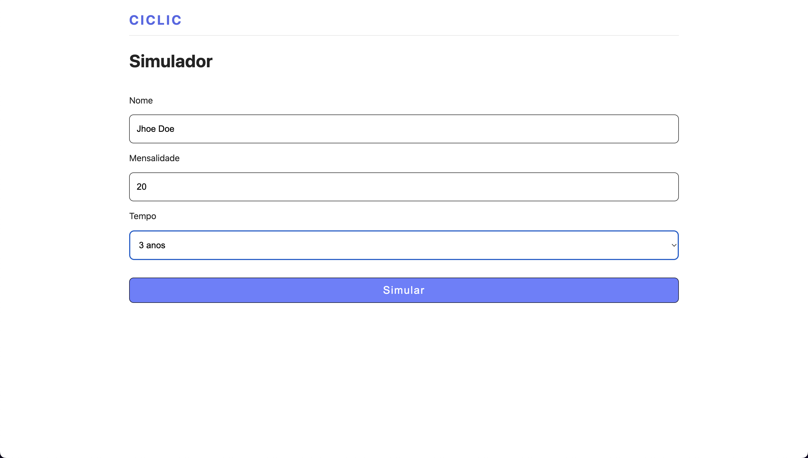
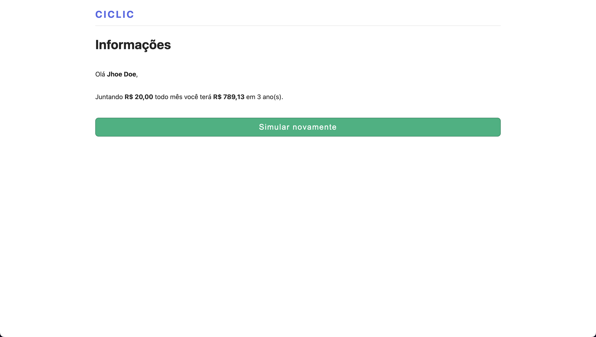

# Ciclic Challenge
## Description
This project consists of making a simple application to calculate compound interest using the math.js api.

It's important to note that the interest rate is fixed and does not represent reality.

Status: DONE ✅

## How it works
The project was developed using vite, React and axios for the requests. Also, I am saving the data in localstorage to use it in another page.

You can see the project running [here](https://ciclic-challenge.vercel.app/).


## Screenshots




## How to run
To run the project, you can clone the repository and run the following commands:

```bash
git clone https://github.com/LivHelen12/ciclic-challenge.git
```

After that, you can run the following commands in the project folder:

```bash
npm install # to install the dependencies

or

yarn install # if you'd like to use yarn
```

and then:

```bash
npm run dev # to run the project

or

yarn dev 
```